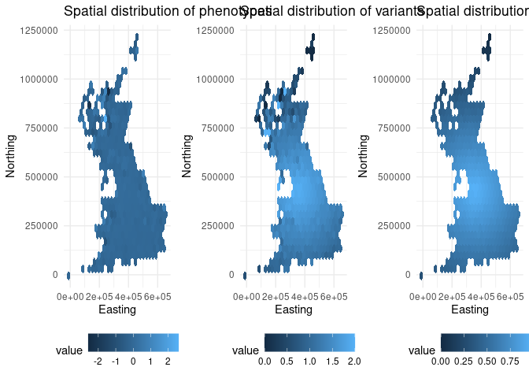
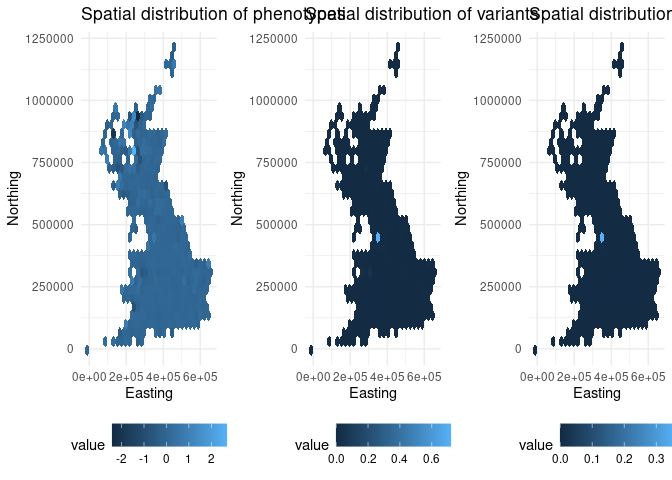
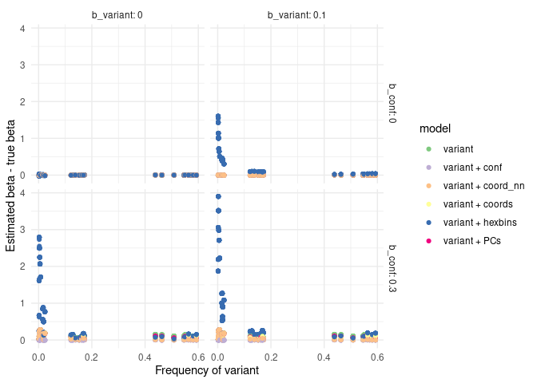
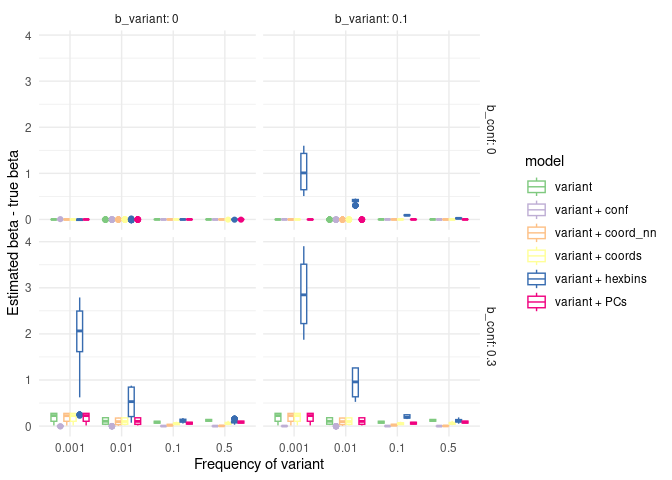

## Background

To what degree does simple spatial confounding get captured / adjusted by PCs?

1. Simulate a confounder which is a spatial gradient from a random centroid in UK Biobank samples
2. Simulate a phenotype which is a function of the confounder and some noise
3. Simulate a variant where the allele frequency is a function of the confounder
4. Examine the association between the phenotype and the variant, with and without PCs and other adjustments

The overall objective is to avoid confounding by capturing the spatial structure of the phenotype.

```
G <--- demography -x-> P
```


## Data

```bash
# #!/bin/bash

datadir="/mnt/storage/private/mrcieu/data/ukbiobank/phenotypic/applications/81499/released/2022-06-07/data"

head -n 1 $datadir/data.51913.csv | tr ',' '\n' > ukb.datafields

less ukb.datafields 

grep -n "^\"129-" ukb.datafields | cut -d ":" -f 1 
grep -n "^\"130-" ukb.datafields | cut -d ":" -f 1 


cut -d "," -f 1,435-440 $datadir/data.51913.csv > ukb.coords
cut -d "," -f 10005-10044 $datadir/data.51913.csv > ukb.pcs
```

Note this way of extracting data is not reliable because of the assumption of comma dilimeted fields. Link the dataset PCs to the phenotype ID


``` r
library(dplyr)
library(data.table)
library(ggplot2)
library(here)
library(nnet)
library(caret)
library(parallel)
library(hexbin)

coords <- fread(here("ukb.coords")) %>% filter(!is.na(`130-0.0`))
names(coords)[2] <- "northing"
names(coords)[5] <- "easting"

# pcs <- fread("/mnt/storage/private/mrcieu/data/ukbiobank/genetic/variants/arrays/imputed/released/2018-09-18/data/derived/principal_components/data.pca1-40.plink.txt")
pcs <- fread(here("data.pca1-40.plink.txt"))

# linker <- fread("/mnt/storage/private/mrcieu/data/ukbiobank/phenotypic/applications/81499/released/2022-06-07/data/linker.81499.csv")
linker <- fread(here("linker.81499.csv"))

pcs <- inner_join(pcs, linker, by=c("V1"="ieu"))
dat <- inner_join(pcs, coords, by=c("app"="eid"))
```


``` r
str(dat)
```

```
## Classes 'data.table' and 'data.frame':	440333 obs. of  49 variables:
##  $ V1      : chr  "IEU3007655" "IEU3987068" "IEU7396518" "IEU8375037" ...
##  $ V2      : chr  "IEU3007655" "IEU3987068" "IEU7396518" "IEU8375037" ...
##  $ V3      : num  -13 -11.5 -12.1 -12.2 -11.6 ...
##  $ V4      : num  6.42 3.48 4.03 3.51 5.41 ...
##  $ V5      : num  -0.183 -1.155 -0.988 -1.626 0.786 ...
##  $ V6      : num  2.93 3.08 0.75 -1.23 -0.94 ...
##  $ V7      : num  -5.89 7.65 -2.36 -5.35 -6.09 ...
##  $ V8      : num  0.941 -0.913 0.432 3.817 1.465 ...
##  $ V9      : num  1.141 -1.549 -0.534 0.579 2.699 ...
##  $ V10     : num  -1.9821 1.4789 -0.6544 -1.1696 0.0794 ...
##  $ V11     : num  -2.7 -1.21 -6.6 1.02 -2.85 ...
##  $ V12     : num  2.508 1.065 -1.534 -0.795 3.514 ...
##  $ V13     : num  2.3638 0.5131 -0.949 -0.0158 -2.7001 ...
##  $ V14     : num  -1.219 1.008 0.292 -1.623 1.513 ...
##  $ V15     : num  -1.55 -2.29 2.91 -1.2 2.1 ...
##  $ V16     : num  0.516 1.617 1.79 -2.022 -6.704 ...
##  $ V17     : num  0.5993 -0.0536 -0.8681 -0.0678 -0.3132 ...
##  $ V18     : num  0.0827 -4.4863 -1.4181 0.6497 -0.4203 ...
##  $ V19     : num  0.798 1.088 -2.362 3.05 3.213 ...
##  $ V20     : num  0.3014 0.0259 1.102 2.6125 2.1207 ...
##  $ V21     : num  4.669 -0.226 0.954 -0.326 -1.687 ...
##  $ V22     : num  -3.97 -0.7786 0.0988 -4.3672 -0.1068 ...
##  $ V23     : num  3.127 -2.261 -3.528 -0.888 -4.225 ...
##  $ V24     : num  -2.286 -3.682 -1.171 -5.49 0.773 ...
##  $ V25     : num  -0.866 2.566 -0.134 -1.204 2.125 ...
##  $ V26     : num  4.52 -4.02 -3 1.79 4.74 ...
##  $ V27     : num  2.054 -1.238 0.179 4.82 -1.388 ...
##  $ V28     : num  -2.69 -2.52 1.63 0.37 -5.44 ...
##  $ V29     : num  0.339 0.35 5.922 -7.439 -0.566 ...
##  $ V30     : num  -0.846 1.6214 -1.8739 -0.0107 2.3634 ...
##  $ V31     : num  -2.692 -1.213 0.399 -2.318 -0.522 ...
##  $ V32     : num  3.68 -1.196 -0.917 -2.18 0.937 ...
##  $ V33     : num  0.677 5.443 2.482 3.578 1.297 ...
##  $ V34     : num  -3.43 1.76 -2.46 -3.1 -2.24 ...
##  $ V35     : num  1.8 -1.21 -6.04 3.3 -2.88 ...
##  $ V36     : num  -2.223 -6.51 0.125 3.394 3.336 ...
##  $ V37     : num  -0.53 5.32 -0.57 -2.88 1.55 ...
##  $ V38     : num  -1.5419 -3.929 1.3796 0.0962 -1.7801 ...
##  $ V39     : num  1.264 1.38 -3.869 0.222 3.197 ...
##  $ V40     : num  0.43 -3.922 -1.763 -0.366 -1.38 ...
##  $ V41     : num  2.31 -1.934 0.157 -0.207 0.311 ...
##  $ V42     : num  -1.56 4.43 -1.1 7.63 -1.85 ...
##  $ app     : int  4279083 2939823 4801344 2757842 3557051 1397521 2742554 3724791 1670023 3369721 ...
##  $ northing: int  271500 392500 222500 187500 171500 120500 166500 384500 424500 402500 ...
##  $ 129-1.0 : int  NA NA NA NA NA NA NA NA NA NA ...
##  $ 129-2.0 : int  NA NA NA NA NA NA NA NA NA NA ...
##  $ easting : int  429500 335500 458500 556500 339500 314500 340500 433500 381500 384500 ...
##  $ 130-1.0 : int  NA NA NA NA NA NA NA NA NA NA ...
##  $ 130-2.0 : int  NA NA NA NA NA NA NA NA NA NA ...
##  - attr(*, ".internal.selfref")=<externalptr>
```


``` r
str(pcs)
```

```
## Classes 'data.table' and 'data.frame':	488295 obs. of  43 variables:
##  $ V1 : chr  "IEU6189432" "IEU3007655" "IEU3987068" "IEU7396518" ...
##  $ V2 : chr  "IEU6189432" "IEU3007655" "IEU3987068" "IEU7396518" ...
##  $ V3 : num  -12.2 -13 -11.5 -12.1 -12.2 ...
##  $ V4 : num  5.39 6.42 3.48 4.03 3.51 ...
##  $ V5 : num  -1.281 -0.183 -1.155 -0.988 -1.626 ...
##  $ V6 : num  0.842 2.928 3.084 0.75 -1.227 ...
##  $ V7 : num  -5.27 -5.89 7.65 -2.36 -5.35 ...
##  $ V8 : num  -1.787 0.941 -0.913 0.432 3.817 ...
##  $ V9 : num  3.11 1.141 -1.549 -0.534 0.579 ...
##  $ V10: num  -2.631 -1.982 1.479 -0.654 -1.17 ...
##  $ V11: num  2.39 -2.7 -1.21 -6.6 1.02 ...
##  $ V12: num  0.308 2.508 1.065 -1.534 -0.795 ...
##  $ V13: num  3.3288 2.3638 0.5131 -0.949 -0.0158 ...
##  $ V14: num  -1.973 -1.219 1.008 0.292 -1.623 ...
##  $ V15: num  -0.605 -1.549 -2.287 2.913 -1.197 ...
##  $ V16: num  -2.045 0.516 1.617 1.79 -2.022 ...
##  $ V17: num  0.5489 0.5993 -0.0536 -0.8681 -0.0678 ...
##  $ V18: num  -3.5349 0.0827 -4.4863 -1.4181 0.6497 ...
##  $ V19: num  0.895 0.798 1.088 -2.362 3.05 ...
##  $ V20: num  -5.9393 0.3014 0.0259 1.102 2.6125 ...
##  $ V21: num  1.003 4.669 -0.226 0.954 -0.326 ...
##  $ V22: num  4.4425 -3.97 -0.7786 0.0988 -4.3672 ...
##  $ V23: num  -1.852 3.127 -2.261 -3.528 -0.888 ...
##  $ V24: num  -1.67 -2.29 -3.68 -1.17 -5.49 ...
##  $ V25: num  -0.655 -0.866 2.566 -0.134 -1.204 ...
##  $ V26: num  -2.18 4.52 -4.02 -3 1.79 ...
##  $ V27: num  0.897 2.054 -1.238 0.179 4.82 ...
##  $ V28: num  -0.275 -2.69 -2.516 1.626 0.37 ...
##  $ V29: num  -1.37 0.339 0.35 5.922 -7.439 ...
##  $ V30: num  -1.2676 -0.846 1.6214 -1.8739 -0.0107 ...
##  $ V31: num  -0.873 -2.692 -1.213 0.399 -2.318 ...
##  $ V32: num  2.375 3.68 -1.196 -0.917 -2.18 ...
##  $ V33: num  1.123 0.677 5.443 2.482 3.578 ...
##  $ V34: num  0.0614 -3.4258 1.7598 -2.4644 -3.1018 ...
##  $ V35: num  -4.38 1.8 -1.21 -6.04 3.3 ...
##  $ V36: num  0.527 -2.223 -6.51 0.125 3.394 ...
##  $ V37: num  -2.48 -0.53 5.32 -0.57 -2.88 ...
##  $ V38: num  2.2685 -1.5419 -3.929 1.3796 0.0962 ...
##  $ V39: num  -1.178 1.264 1.38 -3.869 0.222 ...
##  $ V40: num  -4.456 0.43 -3.922 -1.763 -0.366 ...
##  $ V41: num  2.245 2.31 -1.934 0.157 -0.207 ...
##  $ V42: num  -3.55 -1.56 4.43 -1.1 7.63 ...
##  $ app: int  2981053 4279083 2939823 4801344 2757842 3557051 1397521 2742554 3724791 1670023 ...
##  - attr(*, ".internal.selfref")=<externalptr>
```

## Simulations


``` r
fit_genetic_nn <- function(y, genetic_pcs, 
                          hidden_units = 10, 
                          decay = 0.001,
                          train_prop = 0.8,
                          scale_data = TRUE,
                          set_seed = 123, maxit=100) {
  
  # Set seed for reproducibility
  set.seed(set_seed)
  
  # Combine data
  data <- data.frame(y = y, genetic_pcs)
  
  # Remove any rows with missing values
  data <- na.omit(data)
  n_samples <- nrow(data)
  
#   cat("Sample size after removing NAs:", n_samples, "\n")
#   cat("Number of genetic PCs:", ncol(genetic_pcs), "\n")
  
  # Split into training and testing sets
  train_indices <- sample(1:n_samples, size = floor(train_prop * n_samples))
  train_data <- data[train_indices, ]
  test_data <- data[-train_indices, ]
  
  # Scale the predictors if requested
  if (scale_data) {
    # Calculate scaling parameters from training data
    pc_means <- apply(train_data[, -1], 2, mean)
    pc_sds <- apply(train_data[, -1], 2, sd)
    
    # Scale training data
    train_data[, -1] <- scale(train_data[, -1])
    
    # Scale test data using training parameters
    test_data[, -1] <- scale(test_data[, -1], center = pc_means, scale = pc_sds)
  }
  
  # Fit neural network
#   cat("Fitting neural network with", hidden_units, "hidden units...\n")
  
  nn_model <- nnet(y ~ ., 
                   data = train_data,
                   size = hidden_units,
                   decay = decay,
                   linout = TRUE,  # Linear output for regression
                   trace = FALSE,  # Suppress training output
                   maxit = maxit)   # Maximum iterations
  
  # Make predictions on all data
  if (scale_data) {
    # Scale full dataset for predictions
    full_data_scaled <- data
    full_data_scaled[, -1] <- scale(data[, -1], center = pc_means, scale = pc_sds)
    predictions <- predict(nn_model, full_data_scaled[, -1])
  } else {
    predictions <- predict(nn_model, data[, -1])
  }
  
  # Calculate residuals
  residuals <- data$y - predictions
  
  # Calculate performance metrics
  train_predictions <- predict(nn_model, train_data[, -1])
  test_predictions <- predict(nn_model, test_data[, -1])
  
  train_rmse <- sqrt(mean((train_data$y - train_predictions)^2))
  test_rmse <- sqrt(mean((test_data$y - test_predictions)^2))
  train_r2 <- cor(train_data$y, train_predictions)^2
  test_r2 <- cor(test_data$y, test_predictions)^2
  
  # Print performance
#   cat("\nModel Performance:\n")
#   cat("Training RMSE:", round(train_rmse, 4), "\n")
#   cat("Test RMSE:", round(test_rmse, 4), "\n")
#   cat("Training R²:", round(train_r2, 4), "\n")
#   cat("Test R²:", round(test_r2, 4), "\n")
  
  # Return results
  results <- list(
    model = nn_model,
    predictions = predictions,
    residuals = residuals,
    train_indices = train_indices,
    performance = list(
      train_rmse = train_rmse,
      test_rmse = test_rmse,
      train_r2 = train_r2,
      test_r2 = test_r2
    ),
    scaling_params = if (scale_data) list(means = pc_means, sds = pc_sds) else NULL
  )
  
  return(results)
}

generate_conf <- function(coord1, coord2, centroid, sharpness) {
    # Calculate the distance from the centroid
    distance_from_centroid <- sqrt((coord1 - centroid[1])^2 + (coord2 - centroid[2])^2)
    # Frequency of the variant reduces with distance according to sharpness
    frequency <- distance_from_centroid - min(distance_from_centroid, na.rm=T)
    frequency <- frequency^sharpness
    frequency <- 1 - frequency / max(frequency, na.rm=T)    
}

generate_variant_based_on_location <- function(conf)  {
    variant <- rbinom(length(conf), size = 2, prob = conf)
    return(variant)
}

generate_phen <- function(conf, variant, b_conf, b_variant) {
    phen <- scale(conf) * b_conf + scale(variant) * b_variant + rnorm(length(conf), 0, sqrt(1 - b_conf^2 - b_variant^2))
    return(drop(phen))
}

dgm <- function(centroid, sharpness, b_conf, b_variant, coord1=dat$northing, coord2=dat$easting) {
    conf <- generate_conf(coord1, coord2, centroid, sharpness)
    variant <- generate_variant_based_on_location(conf)
    phen <- generate_phen(conf, variant, b_conf, b_variant)
    return(tibble(variant=variant, conf=conf, phen=phen, northing=coord1, easting=coord2))
}

plot_uk_density <- function(phendat) {
    p1 <- ggplot(phendat, aes(x=easting, y=northing)) +
        stat_summary_hex(aes(z=phen), fun = mean) +
        labs(title="Spatial distribution of phenotypes", x="Easting", y="Northing") +
        theme_minimal() +
        theme(legend.position = "bottom")
    p2 <- ggplot(phendat, aes(x=easting, y=northing)) +
        stat_summary_hex(aes(z=variant), fun = mean) +
        labs(title="Spatial distribution of variants", x="Easting", y="Northing") +
        theme_minimal() +
        theme(legend.position = "bottom")
    p3 <- ggplot(phendat, aes(x=easting, y=northing)) +
        stat_summary_hex(aes(z=conf), fun = mean) +
        labs(title="Spatial distribution of confounders", x="Easting", y="Northing") +
        theme_minimal() +
        theme(legend.position = "bottom")
    gridExtra::grid.arrange(p1, p2, p3, ncol=3)
}

mreg <- function(y, x) {
    x <- model.matrix(~ x)
    beta <- solve(t(x) %*% x) %*% t(x) %*% y
    pred <- x %*% beta
    residuals <- y - pred
    return(residuals)
}

hexbins_adjustment <- function(phendat) {
    bins <- hexbin(phendat$easting, phendat$northing, 
                   xbins = 30, 
                   IDs = TRUE)
    phendat$hex_id <- bins@cID
    # lm(phen ~ as.factor(hex_id), data=phendat)$residuals -> phendat$phen_resid
    phendat$phen_resid <- mreg(phendat$phen, phendat$hex_id)
    summary(lm(phen_resid ~ variant, data=phendat))
}

estimation <- function(dat, phendat) {
    mod1 <- summary(lm(phen ~ scale(variant) + conf, data=phendat))
    mod2 <- summary(lm(phen ~ scale(variant), data=phendat))
    mod3 <- summary(lm(phen ~ scale(variant) + as.matrix(dat[,3:42]), data=phendat))
    mod4 <- summary(lm(phen ~ scale(variant) + northing + easting, data=phendat))
    coord_pred <- fit_genetic_nn(
        y = phendat$phen,
        genetic_pcs = phendat %>% select(northing, easting),
        hidden_units = 10,
        decay = 0.001,
        scale_data = TRUE,
        maxit=25
    )$predictions
    mod5 <- summary(lm(phen ~ scale(variant) + coord_pred, data=phendat))
    mod6 <- hexbins_adjustment(phendat)
    tibble(
        model = c("variant + conf", "variant", "variant + PCs", "variant + coords", "variant + coord_nn", "variant + hexbins"),
        freq = mean(phendat$variant)/2,
        var_beta = c(mod1$coefficients[2,1], mod2$coefficients[2,1], mod3$coefficients[2,1], mod4$coefficients[2,1], mod5$coefficients[2,1], mod6$coefficients[2,1]),
        var_se = c(mod1$coefficients[2,2], mod2$coefficients[2,2], mod3$coefficients[2,2], mod4$coefficients[2,2], mod5$coefficients[2,2], mod6$coefficients[2,2]),
        var_p = c(mod1$coefficients[2,4], mod2$coefficients[2,4], mod3$coefficients[2,4], mod4$coefficients[2,4], mod5$coefficients[2,4], mod6$coefficients[2,4]),
        r2 = c(mod1$r.squared, mod2$r.squared, mod3$r.squared, mod4$r.squared, mod5$r.squared, mod6$r.squared),
        adj_r2 = c(mod1$adj.r.squared, mod2$adj.r.squared, mod3$adj.r.squared, mod4$adj.r.squared, mod5$adj.r.squared, mod6$adj.r.squared),
        n = nrow(phendat)
    )
}

run_sim <- function(centroid, sharpness, b_conf, b_variant, rep=1) {
    args <- tibble(centroid=paste(centroid, collapse=","), sharpness=sharpness, b_conf=b_conf, b_variant=b_variant, rep=rep)
    phendat <- dgm(centroid, sharpness, b_conf, b_variant)
    est <- estimation(dat, phendat)
    bind_cols(args, est)
}
```

Example simulation

- sharpness is 1 (i.e. completely smooth)
- common variant
- strong confounding
- null variant


``` r
set.seed(111)
i <- sample(1:nrow(dat), 1)
phendat <- dgm(c(dat$northing[i], dat$easting[i]), sharpness=1, b_conf = 0.05, b_variant = 0)
plot_uk_density(phendat)
```

<!-- -->

Estimation

Methods:

- `variant + conf`: captures the actual spatial variable
- `variant`: No adjustments
- `variant + PCs`: Adjusts for 40 common variant PCs
- `variant + coords`: Adjusts for northing and easting
- `variant + coord_nn`: Adjusts for a neural network model of the coordinates, trained to fit the phenotype
- `variant + hexbins`: Adjusts for spatial stratification using fixed effects adjustment for 404 hexagonal bins (i.e. within area effect estimates)


``` r
estimation(dat, phendat)
```

```
## # A tibble: 6 × 8
##   model               freq  var_beta  var_se    var_p       r2   adj_r2      n
##   <chr>              <dbl>     <dbl>   <dbl>    <dbl>    <dbl>    <dbl>  <int>
## 1 variant + conf     0.770 -0.000606 0.00169 7.19e- 1 0.00265  0.00265  440333
## 2 variant            0.770  0.0227   0.00151 2.02e-51 0.000517 0.000514 440333
## 3 variant + PCs      0.770  0.0170   0.00155 9.40e-28 0.00110  0.00101  440333
## 4 variant + coords   0.770  0.0182   0.00154 3.30e-32 0.000966 0.000959 440333
## 5 variant + coord_nn 0.770 -0.000121 0.00168 9.43e- 1 0.00259  0.00259  440333
## 6 variant + hexbins  0.770  0.0284   0.00240 2.28e-32 0.000319 0.000316 440333
```

PCs do quite a bad job of capturing any confounding. Using non-linear coordinates works relatively well, but linear coordinates and hexbins do not work well.

Try again with much sharper spatial stratification


``` r
set.seed(111)
i <- sample(1:nrow(dat), 1)
phendat_sharp <- dgm(c(dat$northing[i], dat$easting[i]), sharpness=0.001, b_conf = 0.05, b_variant = 0)
plot_uk_density(phendat_sharp)
```

<!-- -->


``` r
estimation(dat, phendat_sharp)
```

```
## # A tibble: 6 × 8
##   model                 freq var_beta  var_se     var_p      r2  adj_r2      n
##   <chr>                <dbl>    <dbl>   <dbl>     <dbl>   <dbl>   <dbl>  <int>
## 1 variant + conf     0.00271 -0.00444 0.00226 4.93e-  2 0.00269 0.00268 440333
## 2 variant            0.00271  0.0366  0.00151 2.14e-130 0.00134 0.00134 440333
## 3 variant + PCs      0.00271  0.0366  0.00151 4.43e-130 0.00142 0.00133 440333
## 4 variant + coords   0.00271  0.0366  0.00151 3.60e-130 0.00135 0.00134 440333
## 5 variant + coord_nn 0.00271  0.0365  0.00151 1.83e-129 0.00135 0.00135 440333
## 6 variant + hexbins  0.00271  0.422   0.0174  4.26e-130 0.00134 0.00133 440333
```

Now everything works badly.


Try non-linear PCs


``` r
# Choose 100 random samples from the UK Biobank data to use as centroids
centroids <- dat %>%
    filter(!is.na(northing) & northing > 0) %>%
    select(northing, easting) %>%
    slice_sample(n=100)
str(centroids)

param <- expand.grid(
    centroid = 1:10,
    sharpness = c(0.001, 0.01, 0.1, 0.5),
    b_conf = c(0, 0.3),
    b_variant = c(0, 0.1),
    rep= 1:10
)
dim(param)

mclapply(1:nrow(param), function(i) {
    message(paste("Running row", i, "of", nrow(param)))
    tryCatch(
        run_sim(
            centroid = c(centroids$northing[param$centroid[i]], centroids$easting[param$centroid[i]]),
            sharpness = param$sharpness[i],
            b_conf = param$b_conf[i],
            b_variant = param$b_variant[i],
            rep = param$rep[i]
        ),
        error = function(e) {
            message(paste("Error in row", i, ":", e$message))
            return(NULL)
        }
    )   
}, mc.cores=60) %>% bind_rows() -> res
saveRDS(res, here("results", "stratification_sim_1.rds"))
```


``` r
res <- readRDS(here("results", "stratification_sim_1.rds"))
ggplot(res, aes(x=freq, y=var_beta - b_variant, colour=model)) +
    geom_point() +
    labs(x="Frequency of variant", y="Estimated beta - true beta") +
    scale_colour_brewer(type = "qual") +
    facet_grid(b_conf ~ b_variant, labeller = label_both) +
    theme_minimal()
```

<!-- -->


``` r
p1 <- res %>%
ggplot(., aes(x=as.factor(sharpness), y=var_beta - b_variant, colour=model)) +
    geom_boxplot() +
    labs(x="Frequency of variant", y="Estimated beta - true beta") +
    scale_colour_brewer(type = "qual") +
    facet_grid(b_conf ~ b_variant, labeller = label_both) +
    theme_minimal()
p1
```

<!-- -->

``` r
# ggsave(p1, file="temp.pdf", width=14, height=7)
```
